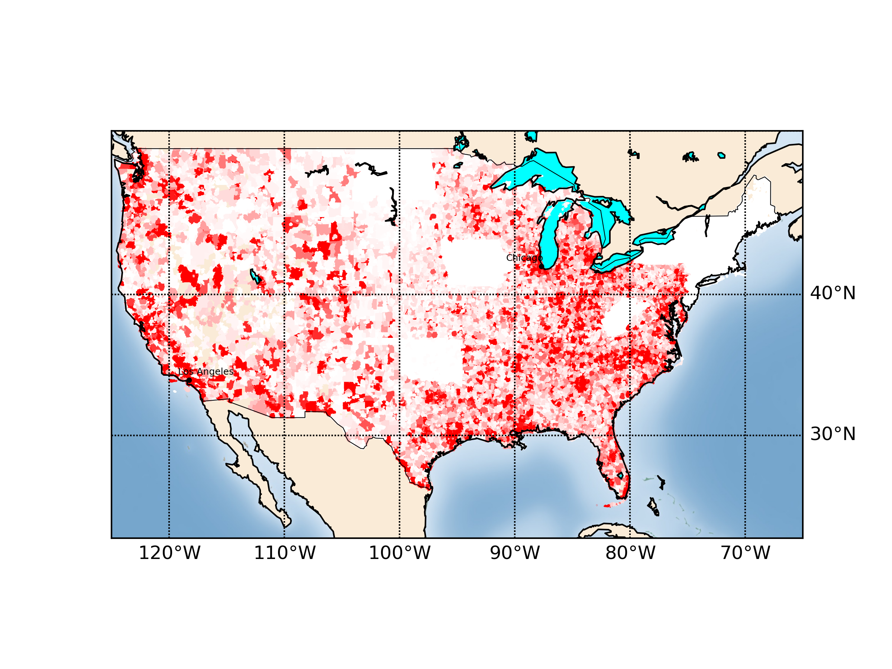

# direct-mail-maps
*Visualize geographic distribution for direct mail*

This package bundles shapefiles for US ZIP codes and UK postal codes with a simple python script for generating maps of letter recipients.  An example image is shown below:

1. Clone the package locally.  The shapefiles folder is intially empty.  You will need to retrieve the shapefiles with

        s3cmd get s3://avantminer/tmp/shapefiles direct-mail-maps/shapefiles/shp.tgz
followed by extraction:

        tar xfv shp.tgz

2. Install the basemap package from mpl_toolkits.  Follow the instructions at <http://matplotlib.org/basemap/users/installing.html>.
3. Create a single-column CSV with the ZIP codes for the direct mail send to be processed.  The most convenient way to do this is to use the `cut` command to strip the ZIP column from a return file.  Save this file in the ZIPs directory.
4. Finally, update the parameters on lines 11-14 of plotmap.py and execute with `python plotmap.py`. 
